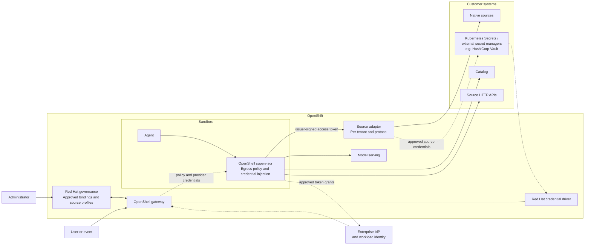

# Enterprise Data Access for Sandboxed Agents

**Audience:** Architecture board
**Status:** Proposed RHOAI product architecture, for decision
**Date:** 2026-09-15
**Scope:** OpenShift, including disconnected deployments; NVIDIA OpenShell sandboxes; any supported agent harness
**Detail:** [Engineering design](agent-data-access-engineering-design.md)

## 1. Summary

Agents in OpenShell sandboxes need governed read and write access to Snowflake, BigQuery, Redshift, PostgreSQL, S3, and HDFS. The hard problem is **identity and credentials**, not connectivity.

- **Integrate, don't rebuild.** Customer identity providers, secret stores, catalogs, and data platforms stay authoritative. No new catalog, ingestion platform, or universal data gateway is needed for agent access.
- **Enterprise credentials must not reach the agent.** OpenShell mediates authentication outside the restricted process; this boundary must pass isolation tests.
- **Processing stays at the source.** Agents receive bounded results or operation handles, not datasets.
- **Red Hat builds OpenShell extensions, not a parallel system:** a governance interceptor, a credential driver, source profiles, and native-protocol adapters.

## 2. Principles

1. **One principal per sandbox,** fixed at launch: either a represented user or an approved workload.
2. **Sources enforce data permissions.** The platform may only narrow access; it never re-authors the customer's policy.
3. **Administrators approve bindings.** A trigger, prompt, or agent can never choose an account, role, or secret.
4. **Fail closed.** An expired or revoked authority never falls back to a broader account.
5. **Disconnected first.** Nothing in the design requires an external call.

## 3. Architecture

Configuration and stored provider credentials reach the supervisor through the gateway. Dynamic token grants contact the configured authorization server under that approved configuration. A trigger can start an approved agent; only authorized administrators change bindings.

## 4. Two data paths

| Path | Used when | How |
|---|---|---|
| **Direct** | The source has a suitable HTTP API (Snowflake SQL API, BigQuery, Redshift Data API, catalog APIs) | The supervisor injects the credential or an exchanged token. The source authorizes and executes. |
| **Adapter** | Native authentication (PostgreSQL, others) that OpenShell cannot credential-rewrite. | The agent calls a small HTTP adapter with an authorization-server-issued token obtained through OpenShell. The adapter verifies it, maps the principal to its approved source account, and connects natively. |

Customer HTTP or MCP services are reused before any adapter is built. MCP is a tool interface, not an identity mechanism.

## 5. Identity and enforcement

| Mode | Source authority |
|---|---|
| **Autonomous workload** | Explicitly approved workload account, independent of whoever triggered it |
| **Represented user** | That user's delegated token or their own mapped account; never broader. Federated delegation depends on customer IdP support. |

**Enforcement happens at three points:**
- **Governance:** approves bindings, sandbox launch, and credential attachment, including cross-user checks for providers attached at creation or later.
- **Supervisor and adapter where present:** enforce endpoint/credential policy and independently verify adapter access. Current-binding checks beyond upstream policy are qualified extension work.
- **Source:** enforces its own grants.

Access intent (read or write) maps to real source roles. SQL inspection is never the authorization boundary.

## 6. Build versus reuse

| Red Hat builds | Reused |
|---|---|
| Governance interceptor: bindings, launch and attachment checks | OpenShell gateway, supervisor, policy, and refresh |
| Credential driver: Secrets first; later multiple backends behind one driver | Customer IdP, Kubernetes Secrets and external secret managers (e.g. HashiCorp Vault), Zero Trust Workload Identity Manager |
| Source profiles derived from RHOAI connection types | Customer source APIs, catalog, and compute near the data |
| Per-protocol adapters, only where no suitable service exists | RHOAI model serving for disconnected inference |

## 7. Prerequisites and risks

| Item | Status | Impact |
|---|---|---|
| OpenShell maturity | Pre-0.1.0; a stable release policy is proposed upstream | A product dependency needs a stable, supported release line |
| OpenShift support | Upstream install is experimental | Qualify sidecar topology under a custom SCC on a pinned release; evaluate split-pod isolation after upstream integration and release |
| Credential isolation | Asserted, not yet proven | Negative-access tests are a release gate |
| Federated user delegation | Depends on the IdP supporting token exchange | IdPs that fail get workload and mapped-account modes only |
| Federated authentication | Qualify the actual OpenShell, IdP, and source path | The strategy’s disabled cloud-token feature flags do not establish a blanket federation blocker |
| Disconnected mode | Harness, model, and token services must be self-hosted or privately reachable | Harness support matrix required. Sources may be on-premises or reached through customer private connectivity (for example VPC peering or private endpoints); the customer defines reachability and permissions. |
| Token services (STS) | OAuth token services and AWS STS `AssumeRole` supported; SAML and AWS web-identity federation not supported upstream | SAML sources need an adapter or SAML-to-OAuth exchange. AWS without ambient credentials requires stored long-lived keys until keyless federation exists. |
| Results may reach the model | Depends on tool and harness behavior | Model endpoints fall under customer data policy |

## 8. Decisions requested

1. Approve the principles and the build-versus-reuse split.
2. Approve the Red Hat OpenShell extensions (governance interceptor, credential driver, adapters) as product components.
3. Approve the staged credential scope: Kubernetes Secrets initially, then multiple backend support through the single Red Hat driver. "Vault" means external secret-manager products such as HashiCorp Vault, not only one vendor. OpenShell's built-in driver covers HashiCorp Vault KV only, so other products need Red Hat driver backends. Simultaneous native OpenShell drivers are not required.
4. Approve the OpenShell dependency conditions: pinned release, stability, and OpenShift qualification.
5. Fund a proof of concept: one workload-mode HTTP source and one represented-user PostgreSQL source through an adapter, covering denial, rotation, revocation, and audit.

Multi-user sandboxes, identity switching, and edge agents are out of scope for this phase.

**Verified corrections and release/main distinctions:** [follow-up review](research/openshell-followup-review.md).
