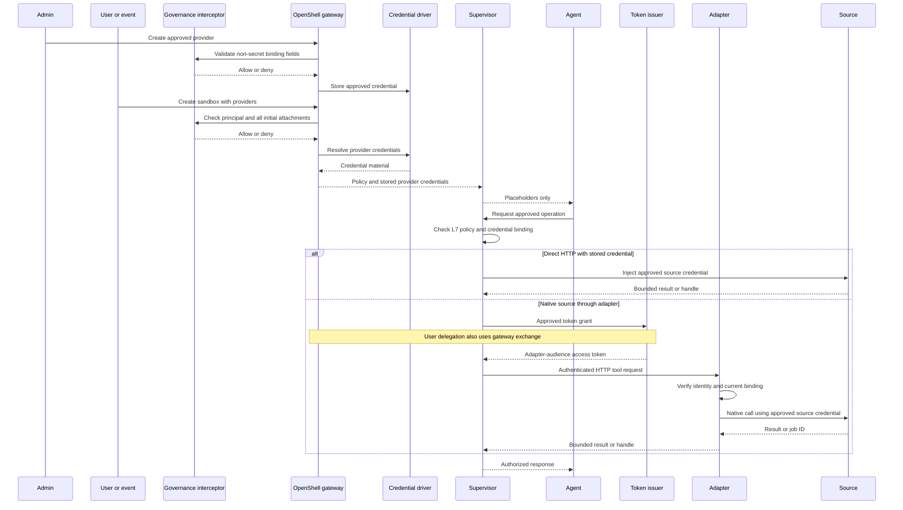

# Enterprise Data Access for Sandboxed Agents — Engineering Design

**Audience:** RHOAI platform, security, and connector engineering
**Status:** Proposed, for design review; not implemented or tested
**Date:** 2026-09-15
**Companion:** [Architecture board summary](agent-data-access-board.md)
**Evidence baseline:** OpenShell `v0.0.116` and `main@fd3fd9c`; see [OpenShell extension evidence](research/openshell-extension-evidence.md)

Everything here follows the board document's principles. Items marked **Requirement** are proposed product behavior. Items marked **Upstream** are documented OpenShell behavior that must be re-verified on the pinned release.

## 1. Component mapping

| Logical role | Implementation | Owner |
|---|---|---|
| Sandbox lifecycle, workspaces, policy, provider attach and detach, refresh | OpenShell gateway | Upstream |
| Governance: bindings, launch and attachment checks, profile catalog | **Gateway interceptor** (RFC 0010, accepted; in `v0.0.116`) | Red Hat |
| Source definitions: endpoints, L7 rules, auth style, token grants | Provider profiles vended by the interceptor, derived from RHOAI connection types | Red Hat content |
| Credential storage | **Remote credential driver** (gRPC over a Unix socket); Kubernetes Secrets backend first, then external secret managers such as HashiCorp Vault. *Upstream:* the in-tree `vault` driver targets HashiCorp Vault KV v1/v2 with Kubernetes or token-file auth. Other secret-manager products need Red Hat driver backends, qualified per product. | Red Hat |
| Credential injection, egress enforcement, token grants | OpenShell network supervisor | Upstream |
| Workload identity | Zero Trust Workload Identity Manager (SPIRE) | Red Hat product |
| Native protocols | Source adapter (§4) | Red Hat or customer |
| Inference | Self-hosted model serving through a provider profile | RHOAI |

**Topology rule:** configuration and stored provider credentials are delivered through the gateway; Red Hat components do not push them directly to supervisors. Dynamic token grants are different: the supervisor calls the configured token issuer, with gateway participation for the documented user-token exchange. Gateway interceptors govern selected control-plane writes, not data requests. Supervisor request middleware is a separate supported extension if runtime checks are needed.

## 2. Binding model

**Proposed record.** Use the OpenShell provider instance as the binding, with protected fields. Validate schema, lookup, and adapter read permissions on the pinned release; this is a product design choice rather than an upstream ownership guarantee.
- Non-secret binding fields go in `metadata.labels` and `config`: principal, logical source, source account or role, intent, binding version.
- Secrets go through the credential driver.
- No separate binding store is needed.

**Approval roles.**

| Role | Approves |
|---|---|
| Platform Admin | Allowed sources, profiles, account classes, and write ceilings per workspace |
| Workspace Admin | Workload bindings and legacy per-user account mappings, within platform bounds |
| User (future self-service) | May request a binding for their own identity through an authorized provisioning service. Upstream Workspace Users cannot create providers; an interceptor cannot override that denial. |

**Interceptor checks.** Modifying/validating security checks use `fail_closed` and `binding_policy = exact`. Observational `post_commit` hooks must use upstream-required `fail_open`. Interceptors see selected writes only and cannot grant rights denied by gateway authorization.

| RPC | Check |
|---|---|
| `CreateProvider` / `UpdateProvider` | Binding fields fall within platform bounds; caller role matches binding type; in self-service mode the principal equals the caller |
| `ImportProviderProfiles` / `UpdateProviderProfiles` / `DeleteProviderProfile` | Only vended profiles; no widening of endpoints or rules; `allow_uninspected_credentials` prohibited |
| `CreateSandbox` | Stamps the principal from the authenticated caller or approved workload template, applies policy, and validates **every initially attached provider**, including template-derived attachments, against that principal |
| `AttachSandboxProvider` | **Mandatory:** the provider's principal must equal the sandbox principal. Upstream lets any Workspace User attach any provider in the workspace. |
| `UpdateConfig` | Rejects policy changes that weaken governed policy |
| Credential rotation and refresh mutations | Cover every corresponding RPC in the pinned interceptor allowlist. Reject unauthorized principal, credential-source, scope, or token-endpoint changes, including changes to already-attached providers |

**Upstream limits to design around:**
- Interceptors cannot see secret fields. User labels alone therefore cannot prove that an imported token or password belongs to the represented user. Use trusted credential provisioning or an issuer-verified identity flow.
- Registration changes need a gateway restart.
- Extension tokens share a signing key with sandbox tokens.
- An unavailable fail-closed interceptor blocks gateway writes, so the interceptor needs high availability.

## 3. Identity modes

| Mode | Mechanism (Upstream) | Notes |
|---|---|---|
| Workload | `token_grant: client_credentials` using the sandbox JWT-SVID, or a static credential for an approved workload account | SPIFFE Workload API is required for the token-grant path, not for ordinary static credential injection |
| Represented user, federated | `token_grant: token_exchange` with the configured authorization server | Qualify delegation and actor claims. User `sub` and sandbox `azp` are an intended profile contract, not claims guaranteed by OpenShell or RFC 8693 alone |
| Represented user, legacy | Adapter maps the verified user principal to that user's own account | Shared broader accounts are rejected at binding approval |

**Restart and resume (Requirement).**
- Preserve the defined logical user/workload for the agent process, but revalidate authority on restart/resume. Do not assume Kubernetes rescheduling invokes `CreateSandbox` or changes the persistent sandbox ID.
- Distinguish the stable sandbox ID from the new process incarnation. A lifecycle reconciliation or re-admission mechanism is required where gateway interceptors do not observe the restart.
- Workspace persistence never preserves authorization automatically.

**Delegation lifetime.**
- *Upstream:* the `--from-oidc-token` path stores the user access token without its OIDC refresh token, and exchange fails after expiry. This does not mean other provider refresh strategies never store refresh material.
- *Requirement:* source access stops at expiry, the agent may continue other work, and there is no fallback.
- *Optional extension:* an approved external refresher (`external` strategy) with an administrator-set absolute deadline per binding.

### Security token services (STS)

Token services that broker short-lived credentials fit the design when they are reachable and speak a supported flow.

| STS pattern | Mechanism | Status |
|---|---|---|
| AWS STS `AssumeRole` | `aws_sts_assume_role` refresh strategy: gateway mints IAM session credentials, proxy signs with SigV4 | *Upstream* |
| OAuth token service, workload | `token_grant: client_credentials` with the sandbox JWT-SVID as client assertion | *Upstream* |
| OAuth token exchange (RFC 8693), user | `token_grant: token_exchange` at the configured authorization server | *Upstream*; IdP qualification required |
| Other gateway-minted tokens | `oauth2_client_credentials`, `oauth2_refresh_token`, `google_service_account_jwt` | *Upstream* |
| Short-lived database credentials (RDS IAM tokens, Redshift temporary credentials, HashiCorp Vault dynamic secrets) | Adapter's own credential path | *Requirement* (adapter work) |

**Gaps.**
- **SAML assertions:** not supported. No SAML grant or placement exists upstream, and token grants inject only bearer or header tokens. Use an adapter, or a token service that exchanges SAML for OAuth.
- **AWS `AssumeRoleWithWebIdentity`:** not documented. `aws_sts_assume_role` uses ambient gateway credentials or stored long-lived keys. On OpenShift outside AWS that usually means long-lived keys, which conflicts with short-lived-credential expectations. Keyless workload federation to AWS needs upstream work or an adapter.
- **Attribution:** AssumeRole is configured per provider, so AWS sees the approved role, not the sandbox or represented user. Session tags and source identity are not documented. OAuth token services do receive the per-sandbox SVID.
- **Reachability:** the STS must be reachable from the gateway or supervisor. In disconnected deployments this means an in-perimeter token service (§8).

## 4. Data paths

### Direct HTTP
- The profile declares endpoint, L7 rules, auth style or token grant, and binaries.
- Credentialed endpoints require L7 inspection. `tls: skip` and uninspected credentials are prohibited.
- OpenShell middleware sees requests only; it cannot see responses. **Results are bounded by operation design at the source:** asynchronous handles, pagination, row caps, exports only to approved destinations.

### Adapter
- **Admission:** no suitable HTTP or MCP service exists, and OpenShell cannot inject the protocol. *Upstream:* Kubernetes rejects transparent `protocol: tcp` capture, but explicit-proxy opaque passthrough remains possible. This is not a blanket native-traffic ban; prohibit opaque bypasses in approved policy. Native credential hiding requires the adapter or a suitable existing HTTP service.
- **Shape:** one deployment per source protocol per tenant (workspace namespace), shared by that tenant's sandboxes, and scaffolded and reconciled centrally. Per-sandbox adapters only where a customer requires them.

**Contract.**
1. **Ingress:** HTTPS. A default-deny NetworkPolicy allows only that tenant's sandbox pods, but reachability is not authentication.
2. **Authentication:** an access token issued by the configured authorization server through OpenShell `token_grant`, with the adapter as audience. Validate signature, issuer, audience, expiry, and the qualified user/workload and actor claims; do not assume all issuers supply `azp`. Authorino is a candidate verifier.
3. **Authorization:** derive the binding server-side from the verified principal and process identity. Requests select only a logical source, never an account, role, DSN, or secret path. Re-check every operation. Give adapters a narrowly scoped read-only binding lookup through an authorized service/API; do not provide platform-admin credentials. The lookup/caching implementation remains product work.
4. **Downstream credentials:** the adapter's own path (Kubernetes Secret, or an external secret manager; for example, HashiCorp Vault's database secrets engine for short-lived database credentials where the customer runs it). Nothing is agent-visible. Pools are segregated by source account and role. Trusted-only file mounts are allowed where native TLS clients need them.
5. **Results:** operations are bounded and there is no raw query export.

## 5. Access sequence

## 6. Lifecycle and failure

**Rotation and revocation.**
- *Upstream:* rotation and detach take effect at the next placeholder resolution. Policy reload closes connections pinned to the old generation. Running processes keep stable placeholders.
- *Requirement:* measure propagation, cached dynamic tokens, persistent HTTP/WebSocket sessions, and gateway partitions. A five-minute ceiling is a qualification target, not an existing lease mechanism or guarantee. If upstream behavior cannot bound stale authority, narrow supported modes or add explicit enforcement through supported middleware. Adapters invalidate known revoked bindings and retire their pools.

**Sessions and certificates.** Refreshing a credential does not end existing source sessions. Source, adapter, and gateway certificate reloads are separate and must each be tested.

**Remote operations (Requirement).**
- The adapter or a controller outside the pod records sandbox principal, source principal, binding version, and source job ID.
- *Upstream extension limit:* request middleware does not expose source response handles. Direct HTTP operation tracking therefore requires source-side history with a validated request/query correlation mechanism, or an adapter for operations needing strong lifecycle guarantees. Principal and time alone are best-effort correlation and cannot distinguish all concurrent processes using the same account.
- Polling, result retrieval, and cancellation are reauthorized.
- After revocation, results are blocked and cancellation is attempted under a narrowly scoped cleanup role. Cancellation is not rollback.
- Uncertain writes are reconciled or made idempotent before any retry.
- Jobs are never silently transferred to a replacement sandbox.

**Failure policy (Requirement).**
- Interceptor or credential driver unavailable: new launches, attachments, and credential resolution fail closed; already-valid cached authority stands until its bound.
- Gateway connectivity loss with a live supervisor may preserve last-known enforcement state. Supervisor failure is a different fault: qualify that agent traffic is blocked or the workload stopped; do not claim a dead supervisor retains enforcement.
- Nothing extends authority locally.

## 7. Isolation and egress

**Topology decision:** OpenShell `sidecar` topology under a **custom least-privilege SCC** for the pod. *Upstream* sidecar mode needs:
- Init container: root with `NET_ADMIN`, `NET_RAW`, `CHOWN`, `FOWNER`.
- Network sidecar: UID 0 with `SYS_PTRACE` and `DAC_READ_SEARCH`, plus `shareProcessNamespace: true`, for binary-aware policy.
- Agent container: sandbox UID, no capabilities, no privilege escalation.
- No other root containers in the pod.

Upstream documents Kata integration; OpenShift suitability remains a qualification item. Split-pod PR #3144 merged into a feature branch, not the checked `main` or release. Evaluate it after integration and release; do not make present isolation claims depend on it.

**Qualification gate (Requirement).** Acting as the real agent identity, attempt to read:
- Sidecar `/proc` memory, `environ`, and file descriptors.
- Control sockets and mounts.
- Projected tokens and TLS secrets.
- The credential-driver namespace and the Kubernetes Secrets API.
- Stale placeholders after detach.

Also confirm there is no egress except through the supervisor. If the gate fails, block the deployment; moving credentials out of the pod alone is not a fix.

**Egress.**
- Default-deny NetworkPolicy on sandbox and adapter namespaces.
- Approved DNS and endpoints only.
- Agent access to gateway administration and driver endpoints blocked, while authenticated supervisor callbacks stay open.
- NetworkPolicy cannot separate same-pod containers, so supervisor enforcement is essential.

## 8. Inference and disconnected operation

- Model endpoints are provider-profile destinations with L7 rules. *Upstream:* `inference.local` is removed on `main`, so do not design on it.
- Disconnected deployments need mirrored OpenShell, agent-sandbox, and adapter images; local IdP, workload identity, and credential stores; self-hosted models; and harnesses qualified against self-hosted endpoints.
- External destinations are a connected deployment profile, defined by customer policy.
- **Disconnected does not mean no sources.** Customers may reach data through private connectivity (for example VPC peering, private endpoints, or dedicated interconnects to cloud warehouses) or through on-premises sources (PostgreSQL, HDFS, S3-compatible object storage, on-premises warehouses). Treat each as an approved destination on the customer's private network. The customer defines network reachability and permissions; the design needs no public internet egress.
- **Token services in disconnected environments** must also run inside the perimeter or be reachable over the same private connectivity: the customer IdP's token-exchange endpoint, HashiCorp Vault, SPIRE (Zero Trust Workload Identity Manager), or a cloud STS through a private endpoint where the customer provides one.
- Authorized results can reach the model, so model endpoints are subject to the customer's data policy.

## 9. Audit

Correlate these sources, without secrets or result contents by default:
- **OpenShell OCSF:** sandbox, policy, and provider events.
- **Interceptor:** decision logs and `post_commit` annotations (binding version, principal).
- **Adapter:** token principal, `azp`, binding version, source account, operation, job ID.
- **Source:** audit logs.

No OpenLineage extension is required.

## 10. Data strategy alignment

- **Connection model:** one connection definition with two delivery modes. Mounted credentials serve Spark, Ray, KFP, and workbenches. Provider profiles serve agents, which never get mounted secrets.
- **Credential brokering:** OpenShell is the HTTP credential broker. Adapters only for native protocols. MCP is optional.
- **Policy:** reuse source grants and OpenShell enforcement. The interceptor governs control-plane changes; the adapter still implements binding authorization. Runtime freshness checks may need supported supervisor middleware. No new general-purpose enterprise policy engine is assumed.
- **Catalog:** agents use the customer catalog as a bound source. No RHOAI catalog is required for agent access.
- **Prerequisites:** qualify gateway identity, workload federation, and source authentication separately. The proposal cites disabled `token-auth-aws/azure/gcp` features in RHOAI 3.4; that does not establish a universal blocker for OpenShell federation. Pin and support the chosen OpenShell release.

## 11. Open engineering decisions

1. Label and config schema for bindings; whether self-service is on by default; derivation from connection types.
2. Credential driver: Kubernetes Secrets initially, then provider-scoped selection among multiple backends behind one registered Red Hat driver. Define reference authorization, HA, and later backend isolation.
3. The custom SCC definition and the pinned OpenShell and OpenShift versions.
4. IdP qualification test and initial supported IdP list.
5. Measured revocation bound and failure-mode test plan.
6. Proof of concept: Snowflake SQL API in workload mode; PostgreSQL through an adapter in represented-user mode, including cross-user attach denial, rotation, revocation, remote-job cleanup, and audit correlation.

**Evidence:**
- [OpenShell extension evidence](research/openshell-extension-evidence.md)
- [Critique assessment](research/opus-critique-assessment.md)
- [Isolation verification](research/opus-isolation-verification.md)
- [Earlier OpenShell evidence](research/agent-data-access-evidence.md)
- [Source evidence](research/enterprise-source-access-evidence.md)
- [Context](agent-data-access-context.md)

- [Follow-up verification and remaining qualification limits](research/openshell-followup-review.md)
