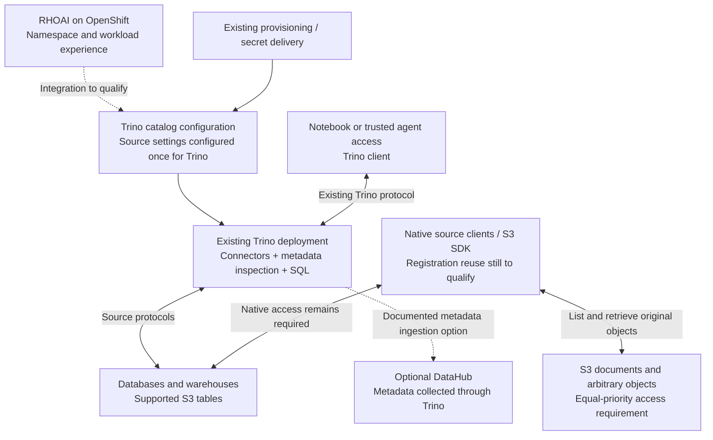
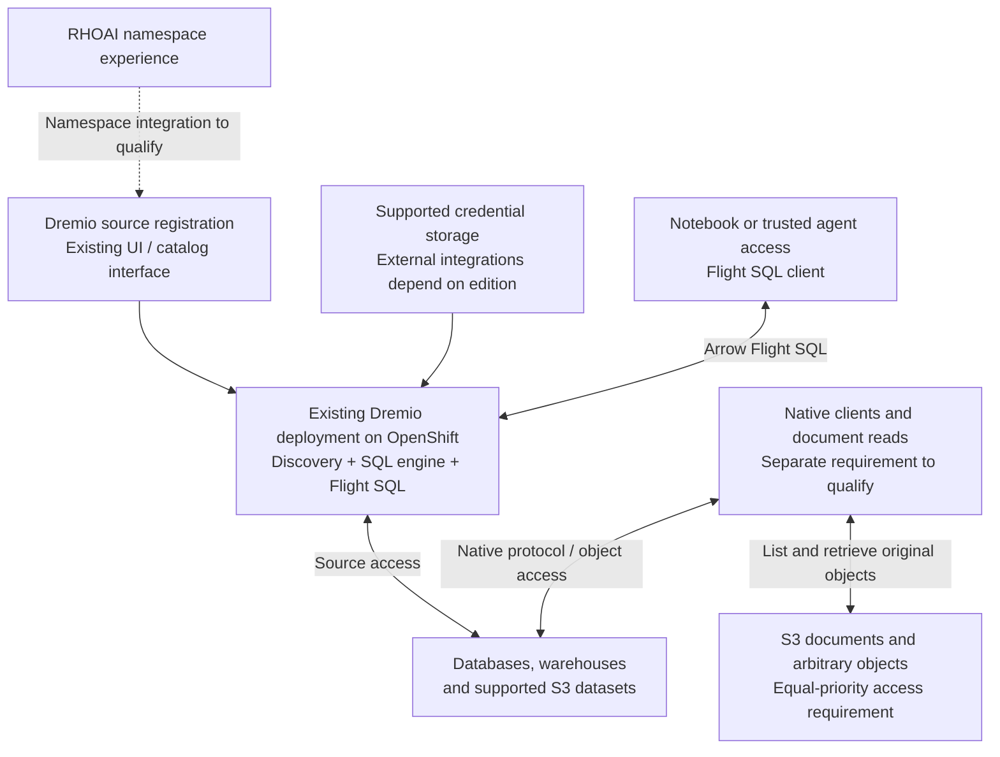
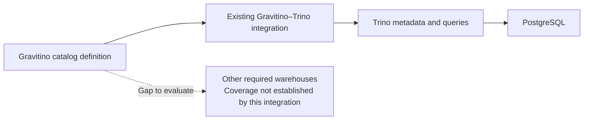

# DCH architecture: assemble existing products

**Status:** Source-level license audit recorded; runtime qualification outstanding; no product selected  
**Updated:** 2026-09-18

**DCH is the capability we want to deliver, not a new platform we have decided to build.** Select an existing product to own connection configuration, discovery, and access wherever possible. RHOAI integrates its namespace and workload experience with that product. Custom development requires a demonstrated gap after evaluating existing interfaces.

**License gate:** Every proposed connector and access path must have verified permissive open-source licensing, including its implementation and required drivers, **except the Oracle vendor driver and its required companion libraries, which the user has accepted as an exception**. Dremio is currently **on hold**, not a recommended foundation: the complete required path has not passed this gate. See the [cross-product audit](research/dch-product-license-summary.md) and [Dremio detail](research/dremio-permissive-license-audit.md). This requirement concerns the software we adopt/distribute; it does not require customer databases such as Snowflake to be open source.

**Structured and unstructured source access are equally important.** A candidate must support both, either itself or through a demonstrated combination of existing products. SQL coverage alone cannot qualify a DCH foundation.

The candidates examined so far are **Trino for SQL access subject to connector/driver qualification** and **Dremio as a held reference for integrated SQL access with Arrow Flight SQL**. These are candidates for the structured-access portion; neither has been shown to satisfy the whole requirement. An equally rigorous off-the-shelf evaluation of unstructured access is still required. Apache Gravitino addresses catalog reuse across engines, but its supported combinations must be checked independently of Trino's connector count.

## 1. Requirements remain the evaluation criteria

| Requirement | Agreed scope |
| --- | --- |
| Deployment and tenancy | OpenShift; registrations belong to the selected namespace. Product tenancy must map to this explicitly. |
| Sources | S3, PostgreSQL, Snowflake, Redshift, BigQuery, Oracle. Db2 deferred. |
| Equal priority | Structured queries and unstructured object/document discovery and retrieval are both initial acceptance criteria. S3 table support alone does not satisfy unstructured access. |
| Discovery | Initial database structure and column details. S3 contains structured files and documents; clients interpret contents. |
| Registration | New setup or one-time import. Missing credentials may be entered once more. No synchronization with the originating tool. |
| Existing investments | Customers keep their tools and secret stores. A universal shared store cannot be required. |
| Access modes | Native source access initially; unified Flight access remains a target. An available product may make unified access practical sooner, but that is an option, not an agreed replacement for native access. |
| Identity | Shared source identity for the initial evaluation. Eventual Alice-specific source permissions remain unresolved. |
| Licenses | Verify permissive open-source terms for each connector and access implementation plus required drivers/dependencies. MIT/Apache-2.0 are accepted examples. Oracle vendor driver/required companion libraries are an accepted exception. Other unknown, commercial-only and nonpermissive paths do not pass. |
| Ingestion | Later; destination copies have separately defined access. |

## 2. Product shortlist

The [cross-product license assessment](research/dch-product-license-summary.md) covers all six products and the supporting libraries. No complete distribution is certified permissive-only. Known mismatches are distinguished from unknown dependencies and missing functional coverage.

“Documented” does not mean tested in our environment. Source-management interfaces do not necessarily export credentials for native clients.

| Product | What it supplies off the shelf | Material gap | Evaluation position |
| --- | --- | --- | --- |
| **Trino** | Catalog configuration, source connectors, metadata inspection and SQL execution. Apache-2.0 project. | Documented client protocol is HTTP-based, not Flight. Native credential delivery and OpenShift namespace mapping are not established. | Conditional structured-access candidate. Apache source does not qualify required vendor drivers; unstructured access also needs a complement. |
| **Dremio Software** | Source registration, metadata policies/catalog, SQL engine, source-management interfaces and Flight SQL. OpenShift deployment documentation. | BigQuery and external secret integrations require Enterprise. Distribution licenses vary; native-client delivery remains unproven. | **On hold at license gate.** Retained as a capability reference; unstructured retrieval also remains unqualified. |
| **Apache Gravitino** | Catalog management and supported integrations that reuse configuration across engines; credential vending in specific contexts. | Not an execution engine. Supported integrations and vending are narrower than our full source list. | Permissive source candidate for supported paths, subject to runtime dependencies and source-coverage gaps. |
| **DataHub** | Metadata ingestion, discovery UI and metadata interfaces; Apache-2.0 project. | Not the required live-access engine or an established native credential broker. | Conditional metadata candidate. PostgreSQL ingestion dependency is LGPL; selected extras require separate qualification. |
| **OpenMetadata** | Source configuration and broad discovery workflows. | Inspected ingestion code uses Collate Community License; workflows depend on its platform. | Ingestion code fails permissive-only gate. Existing-customer integration remains separate from adopting its code. |
| **Airbyte** | Source configuration, schema discovery and extraction/replication. | Current connectors use ELv2; replication is not interactive query access. Source GET omits secret fields. | Current connector code fails permissive-only gate. Existing-customer import remains a separate use case. |

Evidence: [Trino license](https://trino.io/legal.html), [connectors](https://trino.io/docs/current/connector.html), [client protocol](https://trino.io/docs/current/client/client-protocol.html); [Dremio Flight SQL](https://docs.dremio.com/current/developer/arrow-flight-sql/), [source interface](https://docs.dremio.com/current/reference/api/catalog/source/); [Gravitino integration coverage](https://gravitino.apache.org/docs/1.3.0/trino-connector/supported-catalog/); [DataHub project](https://github.com/datahub-project/datahub). See the [connector assessment](research/connection-reuse-connectors.md) for OpenMetadata/Airbyte evidence.

### Coverage depends on the product and edition

| Source | Trino | Dremio Software |
| --- | --- | --- |
| PostgreSQL, Snowflake, Redshift | Listed connectors | Documented sources |
| BigQuery | Listed connector | Enterprise source |
| Oracle | Listed connector; vendor-driver exception accepted | Documented source; driver exception accepted, adapter/distribution still unqualified |
| S3 structured data | Table connectors with appropriate metadata setup | Object-storage source for supported datasets |
| S3 arbitrary documents | General document retrieval not established | General document retrieval not established |

Sources: [Trino inventory](https://trino.io/docs/current/connector.html), [object-storage metadata](https://trino.io/docs/current/object-storage/metastores.html), [Dremio databases](https://docs.dremio.com/current/data-sources/databases/), [BigQuery](https://docs.dremio.com/current/data-sources/databases/google-bigquery/), [S3](https://docs.dremio.com/current/data-sources/object/s3/). Authentication modes and source versions still require qualification.

## 3. Candidate A: Trino owns SQL configuration and access

Evaluate existing Trino catalog configuration as the owner of SQL-source definitions. Do not invent a second registry before demonstrating why the product's mechanisms are insufficient.

**Configuration reuse:** Trino's own metadata inspection and queries use its catalog definition. If richer catalog functionality is needed, DataHub has a Trino ingestion connector. Collecting exposed metadata through Trino can avoid giving DataHub every underlying database credential, but still requires a Trino connection and covers only metadata visible through it. [DataHub Trino connector](https://docs.datahub.com/docs/generated/ingestion/sources/trino).

**Remaining duplication:** native notebook settings, arbitrary S3 document access, and independently managed ingestion tools are not solved by this path. Connecting a notebook to Trino provides common SQL access; it does not fulfill direct-to-source access.

Trino configuration can reference environment variables for secrets. This can consume existing deployment provisioning; it is not a universal secret-store broker. Dynamic catalog management is documented experimental, and inline credentials in `CREATE CATALOG` can appear in logs/UI. Deployment-managed configuration should therefore be evaluated before assuming ready self-service registration. [Secrets](https://trino.io/docs/current/security/secrets.html), [catalog management](https://trino.io/docs/current/admin/properties-catalog.html).

Official Kubernetes Helm instructions exist. OpenShift security context, storage and tenant isolation still need qualification. [Deployment](https://trino.io/docs/current/installation/kubernetes.html).

**Tradeoff:** broad SQL connector coverage, with vendor-driver license qualification still required; Flight and native registration reuse remain open. Building a Flight gateway is not the default response to that gap.

## 4. Held reference: Dremio registration, discovery and Flight

This records an existing implementation of much of the original DCH box, not an approved candidate. Its diagram describes capabilities; it does not assert permissive licensing for the depicted software.

Dremio already provides Flight SQL and source-management interfaces. However, BigQuery and documented external secret-manager integrations require Enterprise. Its default Community build includes non-OSS dependencies; an OSS-only build has reduced capabilities. The root Apache license does not qualify the entire distribution. [BigQuery](https://docs.dremio.com/current/data-sources/databases/google-bigquery/), [secrets](https://docs.dremio.com/current/security/secrets-management/), [distribution explanation](https://github.com/dremio/dremio-oss#oss-only).

Current documentation explicitly covers OpenShift, with testing on ROSA. The documented Helm configuration uses Enterprise. Validate the selected edition and target environment rather than extending that claim to all distributions. [Tested environments](https://docs.dremio.com/current/deploy-dremio/kubernetes-environments/), [configuration](https://docs.dremio.com/current/deploy-dremio/configuring-kubernetes/).

Source responses mask secrets. No reviewed interface establishes credential delivery to arbitrary native clients bypassing Dremio. [Source configuration](https://docs.dremio.com/current/reference/api/catalog/source/container-source-config/).

**License result:** packaged capability does not establish eligibility. BigQuery is documented Enterprise-only, and the default distribution includes non-OSS dependencies. The OSS-only build is not a permissive-only certification. Dremio remains on hold for the required source set; permissively licensed Flight code cannot qualify unrelated source connectors. See the [Dremio assessment](research/dch-dremio-product-fit.md).

## 5. Gravitino: a narrower connection-reuse option

Gravitino is relevant because supported engines consume catalog definitions it manages. This directly addresses configuration reuse, but coverage must be demonstrated.

The expanded audit verified published **1.3.0**, superseding the earlier 1.2.1 assessment. Its Trino catalog list includes Hive, Iceberg, MySQL, PostgreSQL and AWS Glue. JDBC credential vending and consumption by supported engine connectors are now documented release capabilities. This strengthens the reuse case, but does not establish Snowflake, Redshift, BigQuery or Oracle catalog support. [Published downloads](https://gravitino.apache.org/downloads/), [integrations](https://gravitino.apache.org/docs/1.3.0/trino-connector/supported-catalog/), [credential vending](https://gravitino.apache.org/docs/1.3.0/security/credential-vending/).

Run a supported reuse trial before adding Gravitino. Another catalog should earn its place by reducing setup, rather than recreating duplication.

## 6. Ownership, native access and permissions are selection gates

Unstructured access must demonstrate object/document listing, relevant object metadata, and authorized retrieval of original content using the registered source. Parsing, extraction, embeddings and RAG are not prerequisites: content interpretation remains the client's responsibility in the initial scope. A metadata catalog entry without a working retrieval path is insufficient. Arrow Flight remains a target for suitable tabular access; documents need not be converted into tables to count as supported.

The separate object paths in the diagrams are required but not yet product-qualified. An SDK label identifies an access mechanism, not a completed off-the-shelf solution. The unstructured product evaluation must address connection reuse, credentials and namespace authorization with the same rigor as the SQL evaluation.

The selected product should own its source definition. RHOAI may expose it through its experience without maintaining an independently editable duplicate. Whether existing RHOAI connections can provision or reference that product is a qualification question, not a preselected custom controller.

For native access, demonstrate a supported way to deliver authorized client settings and credential bindings. If absent, record the limitation. A product's query engine is not automatically a credential broker for notebooks bypassing it. Shared secret storage helps only where both products support the same binding and access mechanism; it cannot be required of existing customers.

The initial shared identity does not preserve Alice's individual source entitlements. Product login/group permissions and source-user delegation are separate capabilities. Sources continue to control data access; agent credential isolation follows the [existing agent design](agent-data-access-engineering-design.md).

A product catalog named after a namespace is not tenant isolation. Compare native product permissions and per-namespace deployments for enforcement and operating cost. No new policy engine is selected here.

## 7. Limit custom work to demonstrated integration gaps

| Need | Existing capability to try first | Possible bounded integration, only if needed |
| --- | --- | --- |
| Namespace association | Product permissions and deployment scope | RHOAI provisioning/reference mapping |
| One-time import | Source-management and import/export interfaces | Field translation for specific tool/source pairs |
| Credentials | Supported secret/provider mechanisms | Supported extension for a required backend |
| Discovery | Product metadata interfaces and refresh controls | Display metadata in the RHOAI experience |
| Native clients | Supported configuration and credential delivery | Evaluate a limited adapter after documenting the gap |
| Flight | Product implementing Flight already | No custom gateway commitment while product tradeoffs are unresolved |
| Rich catalog | Access product's existing facilities | Add an existing catalog only for a demonstrated need |

Ingestion remains a future product integration. Existing Airbyte/Fivetran deployments may retain their own settings and stores. One-time import does not synchronize them; destination-copy access is separately defined through RHOAI and the destination.

## 8. Evaluation order

1. **Apply the license gate, then evaluate both access categories equally.** Audit complete connector/access paths before recommending products. Trino remains an evaluation candidate, not a blanket approval of every driver; Dremio is on hold. Identify existing products for unstructured discovery and retrieval. Use PostgreSQL and S3 containing both tabular files and documents. Record edition licenses, setup effort, metadata, access modes and OpenShift fit for each path.
2. **Test registration reuse before broadening source counts:** register once, discover, read structured data and retrieve original document bytes, then verify native access through supported mechanisms. Include unreadable objects/tables and multi-page listings; record every additional setup step.
3. **Trial Gravitino on a supported combination** to establish whether it reduces configuration and where coverage stops.
4. **Keep DataHub and ingestion optional.** Add them for demonstrated requirements, not to complete a diagram.
5. **Select a product or demonstrated combination covering both categories.** Trino is the structured-access baseline to qualify per connector; Dremio is a held Flight capability reference. Unstructured access is equally weighted and cannot be deferred to make either qualify. Any proposed scope change requires a separate decision.

No reviewed product is yet established to satisfy every requirement off the shelf. The earlier PostgreSQL driver test demonstrates source behavior only; it does not qualify these products. Deployment, tenant isolation, native credential delivery and production authentication remain untested here.

The architectural direction is **an existing product as the DCH foundation, with RHOAI-specific work limited to proven integration gaps**.

  flowchart TB
      G["Gravitino server Unified metadata + catalog configuration"]
      subgraph T["Trino"]
          A["Gravitino plugin Maps metadata and configures catalogs"]
          P["PostgreSQL connector + JDBC driver"]
          A --> P
      end
      G <-->|"Metadata / configuration API"| A
      P <-->|"SQL and result rows"| DB["PostgreSQL"]
      C["Notebook or agent"] <-->|"Query and results"| 