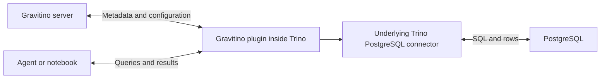

# Gravitino evaluation context

Updated: 2026-09-18. This document consolidates the discussion and research so far. The inspected release is **Gravitino 1.3.0**. Examples are architectural illustrations, not completed integration tests.

## Decision and acceptance criterion

**Gravitino remains a candidate for metadata federation, connection registration, and access coordination. It is not itself the unified query/data-transfer service.**

The user clarified that a ready-made integration with every enterprise catalog is **not required initially**. A credible extension path on both sides satisfies the architectural direction; adapters can be implemented as customer demand arises. Evaluate integrations as:

1. Available and documented today.
2. Feasible through documented APIs/extensions, with mapping and implementation still required.
3. Blocked by a missing capability.

A missing connector is therefore implementation work, not automatically a product disqualifier. Conversely, the presence of APIs does not prove a complete working integration or effortless reuse of credentials and data-access connectors.

## Requirements carried into this evaluation

- Assemble an off-the-shelf solution for the desired DCH capability; avoid building an entire new DCH platform.
- Deploy on Red Hat OpenShift. Namespace is selected during registration. Gravitino-to-namespace isolation remains to be qualified.
- Initial sources: S3, PostgreSQL, Snowflake, Amazon Redshift, BigQuery, and Oracle. Db2 is deferred.
- Structured and unstructured access are equally important. Raw document/file access matters independently of SQL over tabular files or AI document extraction. Clients initially interpret file contents.
- Reuse a connection registration across discovery and access where possible. Initial metadata discovery is a one-time activity at registration, including table and column details.
- Existing customer tools and credential stores may remain unchanged. One-time import of available settings is acceptable; credentials can be supplied again when unavailable. Continuing synchronization is not initially required.
- Begin with a single source identity. RHOAI controls access to connections/credentials; the source controls data permissions. The eventual goal is Alice seeing only what her enterprise identity permits. A shared identity does not satisfy that eventual goal.
- Native client access is an initial path. A unified Arrow Flight interface remains desirable but is a separate capability.
- Prefer permissive OSS such as Apache-2.0 and MIT. Review connector and runtime dependencies, not merely the project's root license. Oracle's vendor driver and required companion libraries are an explicit accepted exception.

## What Gravitino does

Gravitino presents a unified metadata model and API across supported source systems and catalogs. It can manage metadata directly in the underlying systems, rather than requiring a complete harvested copy of every source catalog.

Its own object model includes:

```text
Metalake — tenant/grouping
  Catalog — provider, configuration, connection properties
    Schema
      Table — columns, data types, properties, etc.
      Fileset — logical collection of files/directories, where applicable
```

There are also models for messaging topics and AI models. The model is exposed through Gravitino REST/JSON APIs and SDKs. It is **not a universal conversion into Iceberg metadata**.

Gravitino has its own persistent metadata store, supporting H2, PostgreSQL, and MySQL. It stores its managed state, such as registrations and governance information. Underlying source metadata remains authoritative for federated objects. Fileset definitions describe logical collections whose files remain in storage. Caches also exist; do not interpret direct federation as a guarantee that every call is a fresh source request.

Do not assume its persistent store supplies a complete, independently queryable snapshot of all remote tables and columns after one discovery run. That behavior still needs evaluation against our one-time discovery requirement.

Supported metadata writes can affect the underlying source. For example, its PostgreSQL catalog supports table/schema DDL; it is not inherently a read-only inventory.

Sources: [overview and direct management](https://gravitino.apache.org/docs/1.3.0/overview/), [backend storage](https://gravitino.apache.org/docs/1.3.0/how-to-use-relational-backend-storage/), [PostgreSQL catalog](https://gravitino.apache.org/docs/1.3.0/jdbc-postgresql-catalog/), [fileset model](https://gravitino.apache.org/docs/1.3.0/manage-fileset-metadata-using-gravitino/).

## Catalog and connector coverage

| Category | Documented coverage |
|---|---|
| Databases | PostgreSQL, MySQL, Doris, Hologres, StarRocks |
| Contributed database catalogs | ClickHouse and OceanBase; excluded from standard release packages and built separately |
| Lakehouse/catalog integrations | Hive, Iceberg, Hudi, Paimon, generic lakehouse catalog; AWS Glue also has dedicated documentation |
| Filesets/storage | S3, GCS, Azure Blob Storage/ADLS, Alibaba OSS, HDFS, local filesystem |
| Other assets | Kafka topic metadata; model catalog |
| Consuming engine integrations | Trino, Spark, Flink, Daft; supported catalog combinations differ |

For our six sources, PostgreSQL and S3 have documented paths. No dedicated Snowflake, Redshift, BigQuery, or Oracle catalog was established in the inspected 1.3.0 inventory. PostgreSQL compatibility is not proof of Redshift support; GCS support is not BigQuery support.

The **Gravitino–Trino integration specifically lists Hive, Iceberg, MySQL, PostgreSQL, and AWS Glue**. It does not inherit Trino's entire connector inventory automatically.

Fileset support does not prove automatic crawling of every S3 object, document parsing, or rich document metadata extraction.

Sources: [catalog inventory](https://gravitino.apache.org/docs/1.3.0/), [fileset storage](https://gravitino.apache.org/docs/1.3.0/fileset-catalog/), [Trino integration coverage](https://gravitino.apache.org/docs/1.3.0/trino-connector/supported-catalog/), [tagged module inventory](https://github.com/apache/gravitino/blob/v1.3.0/settings.gradle.kts).

## How clients reach the data

Metadata describes a table; connection configuration tells a compatible connector how to reach its source. Both are needed.



The Trino plugin retrieves catalogs, uses Trino's dynamic catalog mechanism, and maps source properties into connector configuration. Actual PostgreSQL data access occurs from Trino to PostgreSQL. Rows do not flow through the Gravitino server. Trino coordinator/workers need network access to the source.

For direct Python access, the flow discussed was:

1. Read catalog and table metadata from Gravitino.
2. Resolve authorized credentials.
3. Use a native Python source driver to read data.

The PostgreSQL illustration used `requests` and BSD-licensed `pg8000`, with credentials supplied separately. It was not run. It illustrates connection-location reuse, not complete automatic credential reuse.

The Snowflake illustration assumed a **future custom Gravitino metadata adapter**, custom `snowflake.account/database/warehouse/role` properties, and an RHOAI-supplied OAuth token. The agent used Snowflake's Python connector to execute SQL. Those properties are a proposed integration contract, not built-in Gravitino settings.

For these native paths, the client/runtime still needs source-specific libraries. Centralizing metadata does not eliminate that dependency. Placing source libraries behind a unified access service is a separate architectural step.

Sources: [dynamic catalog loading](https://gravitino.apache.org/docs/1.3.0/trino-connector/trino-connector/), [PostgreSQL execution requirements](https://gravitino.apache.org/docs/1.3.0/trino-connector/catalog-postgresql/), [REST metadata operations](https://gravitino.apache.org/docs/1.3.0/manage-relational-metadata-using-gravitino/), [Snowflake Python connector](https://docs.snowflake.com/en/developer-guide/python-connector/python-connector-example).

## Credentials: capability and unresolved version evidence

Gravitino documents credential vending and a dedicated endpoint:

```text
GET /api/metalakes/{metalake}/objects/catalog/{catalog}/credentials
```

However, the inspected **1.3.0 documentation is internally inconsistent**: the capability table dates JDBC user/password vending and engine consumption to 1.3.0, while later sections describe relational catalog vending and credential-hiding migration in terms of 1.4.0. Earlier discussion treated the capability as established in 1.3.0; subsequent inspection exposed this discrepancy.

Therefore, pin the intended release and verify implementation/runtime behavior before depending on JDBC credential vending or the exact catalog-load response. Do not assume passwords are available in ordinary catalog GET responses. Do not assume vending imports or synchronizes arbitrary customer secret stores.

Source: [credential-vending documentation](https://gravitino.apache.org/docs/1.3.0/security/credential-vending/). This qualification supersedes stronger version claims in earlier discussion and research notes.

## Iceberg REST versus Gravitino's general metadata API

Gravitino also supplies an Iceberg REST catalog service. This exposes a standard API **for Iceberg tables**, separate from the broader Gravitino metadata API.

- Engines with compatible Iceberg clients can use this endpoint without a general Gravitino-specific adapter.
- Ordinary PostgreSQL or Snowflake tables do not become Iceberg tables by registering metadata.
- ClickHouse's Iceberg REST support provides a potential Iceberg-only consumption path, not access to every Gravitino catalog; that pairing was not tested.
- An Arrow object returned by a Python reader is not an Arrow Flight connection.

The alternative Snowflake example used PyIceberg against Snowflake Horizon's Iceberg REST endpoint for a **Snowflake-managed Iceberg table**. The catalog provides metadata and potentially storage credentials; PyIceberg reads files from object storage and performs the scan in the agent runtime. It does not execute the example scan in a Snowflake SQL warehouse. Horizon's REST `warehouse` setting identifies the database in that example.

External file reads must not be assumed to preserve Snowflake row-access/masking policies. Snowflake documents a separate policy-enforced external-engine path; the small PyIceberg example did not establish that behavior.

Sources: [Gravitino Iceberg REST scope](https://gravitino.apache.org/docs/1.3.0/iceberg-rest-service/), [PyIceberg API](https://py.iceberg.apache.org/api/), [Snowflake Horizon external access](https://docs.snowflake.com/en/user-guide/tables-iceberg-access-using-external-query-engine-snowflake-horizon).

## Enterprise catalog integration opportunities

No dedicated, documented full-catalog Gravitino integration was found for the following systems. **All expose metadata-reading interfaces**, making them candidates for customer-driven adapters.

| System | Interface established | Mapping scope / qualification |
|---|---|---|
| OpenMetadata | REST entity APIs | Tables, columns, related metadata. [Table API](https://docs.open-metadata.org/v1.12.x/api-reference/data-assets/tables) |
| Atlan | APIs and SDKs | Search/retrieve connections, tables, columns, other assets. [Search APIs](https://docs.atlan.com/product/capabilities/build-apps/sdks/python/search/references) |
| DataHub | GraphQL and metadata APIs | Search datasets and retrieve entity metadata. [GraphQL guide](https://github.com/datahub-project/datahub/blob/master/docs/api/graphql/getting-started.md) |
| Collibra | Core REST API | Assets, attributes, relationships, domains; tables/columns map through the asset model. [API](https://developer.collibra.com/api/rest/data-governance) |
| Alation | Relational Integration APIs | Sources, schemas, tables, columns, custom fields. [API overview](https://developer.alation.com/dev/docs/alation-api-overview) |
| Informatica | EDC REST APIs and product-specific cloud APIs | Objects, searches, relationships, exports; qualify the exact customer product/version. [EDC APIs](https://docs.informatica.com/data-catalog/common-content-for-data-catalog/10-5-7/what-s-new-and-changed--10-5-7-/part-10--versions-10-4---10-4-0-2/10-4-what-s-new/enterprise-data-catalog/rest-apis.html) |

Proposed integration direction:

```text
Existing enterprise catalog API
    → customer-specific adapter and object/type/identifier mapping
    → Gravitino unified metadata model
```

This establishes a credible source-side extension path, not completed Gravitino plugin designs for all six. Governance annotations, lineage, unstructured objects, capabilities, and permissions may not map one-to-one. Metadata-reading APIs do not establish secret export or data-query capability.

Additional narrow paths discovered:

- Atlan documents an Iceberg REST crawler. It could potentially ingest Gravitino Iceberg metadata into Atlan; the pair was not tested. This is not full reverse federation. [Atlan Iceberg](https://docs.atlan.com/apps/connectors/data-lakehouses/iceberg/concepts/how-atlan-connects-to-iceberg)
- DataHub provides Iceberg ingestion and REST-catalog integrations; no Gravitino-specific tested pairing was found. [DataHub Iceberg](https://docs.datahub.com/docs/generated/ingestion/sources/iceberg)
- Informatica Cloud Data Integration has an Open Table Connector supporting Iceberg REST catalogs. This is a data-integration capability, not proof of enterprise catalog federation with Gravitino. [Connector guide](https://docs.informatica.com/content/dam/source/GUID-5/GUID-5088141A-C56F-4F55-A470-F6D49E1169E6/11/en/__OpenTableConnector_en.pdf)
- Snowflake can consume external Iceberg REST catalogs; Horizon exposes Iceberg tables to external clients. Gravitino supports a REST backend, suggesting standards-based integration candidates in either direction. No tested Gravitino–Snowflake setup was found. Ordinary Snowflake table discovery remains an adapter requirement.

## Lineage

Gravitino supports OpenLineage-based collection and processing. Its documented capture integration is Spark, including column lineage and identifier mapping into Gravitino namespaces. The server receives events at `/api/lineage` and supports logging or forwarding to an OpenLineage-compatible service such as **Marquez**.

```text
Instrumented Spark job → OpenLineage events → Gravitino → log or external lineage service
```

Registering a source does not generate lineage. Trino, ClickHouse, agents, and notebooks need appropriate event-producing integrations. Do not assume Gravitino alone provides a complete persistent lineage graph and browsing UI; the reviewed documentation establishes collection/processing/forwarding.

Sources: [lineage overview](https://gravitino.apache.org/docs/1.3.0/lineage/lineage/), [Spark capture](https://gravitino.apache.org/docs/1.3.0/lineage/gravitino-spark-lineage/), [server sinks](https://gravitino.apache.org/docs/1.3.0/lineage/gravitino-server-lineage/).

## License and validation status

Gravitino has an Apache-2.0 project baseline. The PostgreSQL JDBC driver has a permissive license. The complete selected connector/runtime/image dependency closure has **not** received a permissive-only approval. A commercial catalog's readable API establishes integration feasibility, not permissive licensing of that product or any required SDK.

No end-to-end Gravitino deployment, Snowflake adapter, credential-vending flow, enterprise-catalog adapter, or OpenShift isolation test was completed during this discussion. Earlier standalone PostgreSQL validation does not count as a Gravitino integration test.

Related local research: [catalog license audit](research/catalog-products-permissive-license-audit.md), [overall architecture](dch-connection-architecture.md), [product license summary](research/dch-product-license-summary.md). Read their earlier conclusions with the updated extension acceptance criterion and credential-version qualification above.

## Next evaluation questions

1. Verify the target release's credential-vending implementation and authorization behavior.
2. Validate PostgreSQL metadata discovery plus direct client access, and S3 raw-file/fileset access, on OpenShift.
3. Establish whether one-time discovery snapshots need a separate persistence capability.
4. Prove one representative enterprise-catalog adapter, including table identity/type mapping and read-only capabilities, when customer demand selects the catalog.
5. Keep native data access and future unified Arrow Flight service decisions separate from metadata federation.
6. Qualify namespace isolation, user identity, source permissions, and complete runtime licensing before deployment selection.
